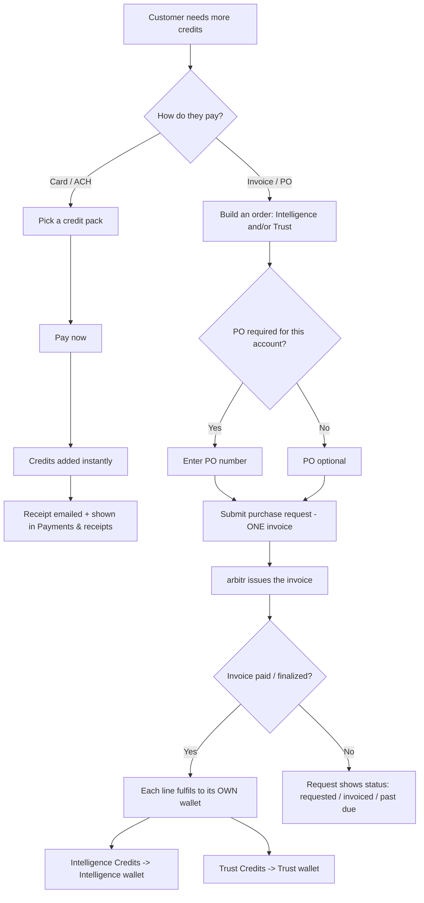
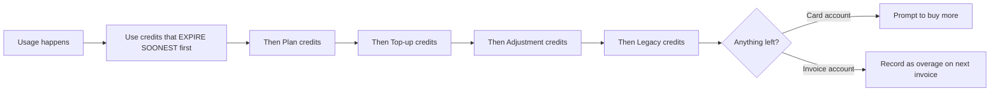

# arbitr Billing — Simple Requirements

*One page for Finance and Dev. Plain words. If a 12-year-old can't follow it, it's wrong.*

---

## 1. The big idea (in one breath)

You **subscribe to a plan**. The plan adds **credits** to your account every month — like an allowance.
You **spend credits** to use arbitr. If you run low, you **buy more**. You always get a **receipt or invoice**.

That's it. Everything below is just the details.

---

## 2. The two kinds of credits (two separate wallets)

There are **two separate wallets**. The two kinds of credits are **NOT interchangeable** — Intelligence Credits can never be spent as Trust Credits, or the other way around. Each wallet has its own balance, its own price, and its own history.

| Wallet | Credit type | What it's for | Price per credit |
|---|---|---|---|
| **Intelligence wallet** | **Intelligence Credits (IC)** | Everyday AI work (translation, analysis) | ~$0.01 each, cheaper in bulk |
| **Trust wallet** | **Trust Credits (TC)** | Human expert review & sign-off | $38 each (or 3 for $110) |

---

## 3. Two ways to pay (the "rail")

Every account pays **one of two ways**. This is the single most important setting — it changes the whole page.

| Rail | Who | What they see |
|---|---|---|
| **Card / ACH** | Self-serve customers | Buy credits instantly. Get receipts. **Never** see invoices, POs, or "Net 30." |
| **Invoice / PO** | Big / procurement customers | Get a bill, pay later. See invoices, PO numbers, payment terms. |

**Rule:** A card customer should never see an invoice. An invoice customer should never be pushed to "pay by card." The page is shaped by the rail.

---

## 4. The plans

| Plan | Price | Monthly Intelligence Credits | Trust Credits |
|---|---|---|---|
| Standard | $20/mo | 1,000 | — |
| Plus | $35/mo | 2,000 | — |
| Team | $100/mo | 5,000 | 2 |
| Enterprise | Contract | Big (negotiated) | Yes |

---

## 5. The golden rules (must always be true)

1. **The numbers always add up.** The big balance on the Overview screen = the running total in the ledger = the reconciliation summary. Always. No mystery numbers.
2. **Every credit is traceable.** Every credit added or spent has a row in the ledger that says where it came from and where it went.
3. **Spend the credits that expire first.** If some credits expire soon, those get used first so they don't go to waste.
4. **Over-budget is shown honestly.** If you use more than your plan gives, we say so plainly ("2,104 of 1,000 used · 1,104 over plan") — we never quietly hide it at 100%.
5. **Money actions are protected.** Changing balances or how an account is billed needs a reason, a record, and sometimes a second person's approval.
6. **The two wallets stay separate.** Intelligence Credits and Trust Credits have their own balances, own prices, and own history. They are not interchangeable and never mix.

---

## 6. Glossary

- **Credit** — the thing you spend to use arbitr. Comes in two kinds (Intelligence and Trust) that are **not interchangeable**.
- **Wallet** — a balance that holds one kind of credit. There are two: the Intelligence wallet and the Trust wallet.
- **Plan grant** — the allowance of credits you get each month.
- **Top-up** — buying extra credits.
- **Ledger** — the receipt book. Every credit in and out.
- **Reconciliation** — proof the receipt book adds up to the balance shown.
- **Overage** — using more credits than your plan gave you.
- **Rail** — how you pay: card now, or invoice later.
- **PO (Purchase Order)** — a company's "approved to spend" number, written on the bill.
- **Net 30** — "pay this bill within 30 days."
- **Past due** — a bill that wasn't paid in time.
- **Adjustment** — a manual fix to a balance, done by arbitr staff with a reason.
- **Combined order** — buying Intelligence AND Trust credits on **one** invoice.

---

## 7. Workflow diagram

### Buying credits (both rails)



### Spending credits (which credit first)

*This order runs inside one wallet. Intelligence Credits and Trust Credits are spent from their own wallets and never substitute for each other.*



---

## 8. Scenarios (Gherkin — copy/paste-able for dev tests)

### Buying & wallets

```gherkin
Feature: Buying credits

  Scenario: Self-serve customer buys credits with a card
    Given I am a Card/ACH customer
    When I pick a credit pack and pay
    Then the credits are added to my Intelligence wallet immediately
    And a receipt appears in "Payments & receipts"
    And I never see an invoice or PO field

  Scenario: Invoice customer requests a top-up
    Given I am an Invoice/PO customer
    And my account requires a PO number
    When I try to submit a top-up without a PO
    Then the request is blocked until I add a PO
    When I add a PO and submit
    Then a tracked purchase request is created
    And the credits are NOT granted yet
    And I am told credits arrive when the invoice is paid or finalized

  Scenario: Buy Intelligence and Trust credits on one invoice
    Given I am an Invoice/PO customer
    When I add Intelligence credits and Trust credits to one order
    Then I see two separate line items with separate prices
    And I see one combined invoice total
    When the invoice is paid
    Then the Intelligence Credits go to the Intelligence wallet
    And the Trust Credits go to the Trust wallet
    And the two credit types are not interchangeable and never mix
```

### The numbers add up

```gherkin
Feature: Trust the numbers

  Scenario: The wallet always reconciles
    Given any account
    When I open "Usage & Ledger"
    Then the reconciliation total equals the big balance on Overview
    And the last row of the ledger equals that same balance

  Scenario: Expiring credits are used first
    Given I have promotional credits that expire June 30
    And I also have plenty of plan credits
    When I use credits
    Then the expiring promotional credits are spent first
    And the ledger shows that drawdown

  Scenario: Going over the plan is shown honestly
    Given my plan gives 1,000 credits
    And I have used 2,104 credits this cycle
    Then the meter says "2,104 of 1,000 plan credits used"
    And it says "1,104 over plan"
    And it explains the overage was drawn from my top-up balance
```

### Bills & payment

```gherkin
Feature: Invoices

  Scenario: A past-due invoice can be paid right from the warning
    Given I have 1 past-due invoice for $45
    Then I see a red banner saying it is past due
    And the banner has a "Pay $45 now" button with the real amount
    When I click "Pay now"
    Then that invoice is marked paid
    And the held credits are released
    And the warning goes away

  Scenario: Card customers never see invoice warnings
    Given I am a Card/ACH customer
    Then I never see a past-due invoice banner
    And I never see PO or Net-terms wording
```

### Finance controls (the safety locks)

```gherkin
Feature: Protecting money actions

  Scenario: A manual credit adjustment needs a reason and a record
    Given I am an arbitr finance admin
    When I adjust a customer's balance
    Then I must choose a reason code
    And I must write a note
    And I must give a reference (ticket / invoice / contract)
    And the change is written to the audit log with my name and a timestamp

  Scenario: Big or risky adjustments need a second approver
    Given an adjustment is over 1,000 credits, OR removes credits, OR is for an Enterprise account
    Then a second approver is required before it applies

  Scenario: Changing how an account is billed is controlled
    Given I am a customer admin
    Then I can only REQUEST a billing-rail change, not flip it myself
    And the request needs a reason and an impact acknowledgment
    And risky changes need arbitr finance approval
    And the request is written to the audit log

  Scenario: Whether a PO is required is an account setting
    Given an arbitr admin turns on "PO required" for an account
    Then every top-up request for that account must include a PO
    When they turn it off
    Then top-ups can be submitted without a PO
```

---

## 9. Who sees which tabs (rail decides)

| Tab | Card / ACH | Invoice / PO |
|---|---|---|
| Overview | ✅ | ✅ |
| Plans | ✅ | ✅ (as "Plan & Contract") |
| Buy credits / Top-up requests | ✅ Buy now | ✅ Request flow |
| Usage & Ledger | ✅ | ✅ |
| Invoices | ❌ | ✅ |
| Payments & receipts | ✅ | ❌ |
| Admin | only Enterprise + admin role | only Enterprise + admin role |

---

## 10. What's real vs. demo (so dev/finance aren't surprised)

- **Real & tested (154 automated tests):** all the rules above — pricing, the numbers adding up, consumption order, overage, two-wallet separation, combined-order fulfillment, PO enforcement, adjustment safety, rail permissions, past-due pay.
- **Demo conveniences (would be automatic in production):**
  - "Mark paid & grant" is a button so you can watch fulfillment happen in a demo; in production it fires automatically on payment.
  - The rail switcher labelled "Demo environment" is hidden in production.
  - No real bank/card charge or PDF generation yet — those are integration work.
