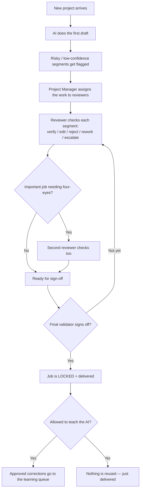
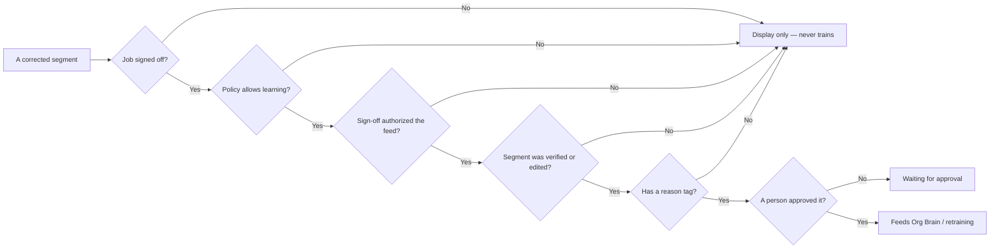

# arbitr Human-in-the-Loop (HITL) — Simple Requirements

*One page for Finance and Dev. Plain words. If a 12-year-old can't follow it, it's wrong.*

---

## 1. The big idea (in one breath)

The AI does a **first draft**. Then **people check the parts that matter** before anything is sent to the customer.
Nothing risky ships until a person says **"yes, this is good."** Every choice is **written down** so we can always see who did what.

That's it. Everything below is just the details.

---

## 2. The cast (who does what)

| Person | What they're allowed to do |
|---|---|
| **Vendor reviewer** | Check and fix the segments on **their own assigned job only**. Can't see other vendors' work. |
| **Internal reviewer** | Check and fix segments on any job in their team's scope. |
| **Project manager** | Hand jobs out to reviewers, move them around, balance the load. |
| **Final validator** | The last "yes." Signs off the whole job and locks it. |
| **Admin (arbitr)** | Set the rules, fix mistakes, approve learning. |

**Rule:** every action checks "are you allowed to do this?" first. If not, it's blocked **and** the attempt is recorded.

---

## 3. The pieces (what we're moving around)

Think of it like a stack of pages going through a checking line.

- **Project** — the whole job (e.g. "Q3 Earnings Report → Japanese").
- **Task** — a chunk of the project given to one reviewer.
- **Segment** — one sentence/row to check. The smallest unit.
- **Decision** — what a person did to a segment (approved it, edited it, sent it back…).
- **Sign-off** — the final "the whole job is good," which **locks** everything.
- **Audit log** — the diary. Every action, forever.

---

## 4. What can happen to a segment

A reviewer looks at each segment and picks one:

| Decision | Plain meaning |
|---|---|
| **Verify** | "This is correct." |
| **Edit** | "I fixed it — here's the better version." |
| **Accept** | "The AI's suggestion is good, keep it." |
| **Not verified / Reject** | "This is wrong." |
| **Needs rework** | "Send it back to be redone." |
| **Escalate** | "I'm not sure — someone senior should look." |
| **Lock** | "Frozen. No more changes." (final validators only) |

---

## 5. The human gates (the whole point of HITL)

These are the moments a **person must say yes**. The AI can never skip them.

1. **Segment review** — a human checks the flagged sentences.
2. **Four-eyes** — for important jobs, a **second** reviewer checks too.
3. **Final sign-off** — the right senior person signs the whole job, which locks it.
4. **Learning approval** — before any correction is used to teach the AI, an authorized person approves it.

---

## 6. The golden rules (must always be true)

1. **Permission first.** Every change checks the person's role. Blocked attempts are logged, not silently dropped.
2. **Everything is written down.** Every action and every denial goes in the audit log with who, what, and when.
3. **Sign-off locks the work.** Once a job is signed off, its segments are frozen and the record can't be edited.
4. **The AI only learns from approved, tagged work.** A correction trains the AI **only if** the job is signed off, the policy allows it, the sign-off authorized it, the segment was verified/edited, and a person tagged *why* and approved it.
5. **Vendors stay in their lane.** A vendor reviewer can only touch their own assigned segments — never another vendor's.
6. **Auto-assign only when it's safe.** The system can pick a vendor automatically only if the rules allow it AND the match score is high enough AND the pool doesn't require manual approval. Otherwise a human decides.

---

## 7. Glossary (say it like you're 12)

- **HITL** — "Human In The Loop." A person checks the AI's work.
- **Segment** — one sentence/row to review.
- **Verify** — mark something correct.
- **Escalate** — ask someone more senior to look.
- **Sign-off** — the final approval that locks the job.
- **Lock** — frozen; no more edits.
- **Four-eyes** — two people review instead of one.
- **Audit log** — the permanent diary of every action.
- **Retraining** — using approved corrections to make the AI smarter.
- **Org Brain** — the company's approved memory the AI can reuse.
- **Rationale tag** — a short reason label a reviewer attaches (so the AI learns the *why*, not just the *what*).
- **Vendor** — an outside team that does review work.
- **Selection engine** — the helper that recommends the best vendor for a job.

---

## 8. Workflow diagrams

### A document's journey



### The learning gate (can this correction teach the AI?)

*All must be YES, or it does not train the AI.*



---

## 9. Scenarios (Gherkin — copy/paste-able for dev tests)

### Reviewing segments

```gherkin
Feature: Reviewing segments

  Scenario: A reviewer verifies a segment
    Given I am a reviewer with permission on this job
    When I mark a segment "Verified"
    Then the segment's decision becomes "verified"
    And the action is written to the audit log with my name and the time

  Scenario: A reviewer edits a segment
    Given I am a reviewer with edit permission
    When I change a segment's text and save
    Then the new text becomes the segment's value
    And the original value is kept in the record

  Scenario: A vendor reviewer cannot touch another vendor's work
    Given I am a vendor reviewer
    When I try to act on a segment that is not on my assignment
    Then the action is blocked
    And a "access denied" entry is written to the audit log

  Scenario: Locked segments cannot be changed
    Given a segment has been locked at sign-off
    When anyone tries to edit it
    Then the change is refused
    And the refusal is written to the audit log
```

### Handing out work

```gherkin
Feature: Assigning work

  Scenario: Assign a task to one reviewer
    Given I am a project manager
    When I assign a task to a reviewer
    Then that reviewer sees it in "My Queue"
    And the assignment is logged

  Scenario: Four-eyes review on an important task
    Given I am a project manager
    When I add a second reviewer as a collaborator
    Then the task becomes a parallel (four-eyes) review

  Scenario: Reassigning requires a reason
    Given I want to move a task to a different reviewer
    When I reassign it without giving a reason
    Then the reassignment is blocked until I add a reason
```

### Final sign-off

```gherkin
Feature: Final sign-off

  Scenario: Only the right role can sign off
    Given a job requires a "final validator" to sign off
    When someone without that role tries to sign off
    Then it is blocked
    And the mismatch is written to the audit log

  Scenario: Sign-off locks everything
    Given I am the final validator
    When I sign off the job
    Then an immutable sign-off record is created
    And every segment in the job is locked
    And the project moves to "signed off"
```

### Teaching the AI (the safety gate)

```gherkin
Feature: Only approved work teaches the AI

  Scenario: A correction is queued for learning
    Given a job is signed off
    And the policy allows learning
    And the sign-off authorized the feed
    And the corrected segment has a reason tag
    When the learning queue is built
    Then that segment becomes a pending learning candidate

  Scenario: Untagged corrections never train the AI
    Given a corrected segment has no reason tag
    Then it is shown for the record only
    And it never enters the learning queue

  Scenario: Learning needs a human approval
    Given a pending learning candidate
    When an authorized person approves it
    Then it feeds Org Brain with the list of people who shaped it
    And the approval is written to the audit log

  Scenario: Policy can forbid learning entirely
    Given a project's policy says "do not reuse"
    Then no segment from that project can ever train the AI
```

### Picking a vendor

```gherkin
Feature: Vendor selection

  Scenario: Recommend the best-matched vendor
    Given a project needs a vendor
    When the selection engine runs
    Then vendors that fail the hard rules are disqualified with reasons
    And the rest are ranked by score
    And the top match is recommended

  Scenario: Auto-assign only when it is safe
    Given a recommended vendor
    When the policy allows auto-assign
    And the score is above the threshold
    And the pool does not require manual approval
    Then the vendor can be assigned automatically
    Otherwise a human must approve the assignment
```

---

## 10. Where each rule lives (for Dev)

| Rule / workflow | Code |
|---|---|
| Permission gate + denial logging | `services/hitl/rbac.js` |
| Segment decisions (verify/edit/reject/lock) | `services/hitl/review.js` |
| Final sign-off + lock + immutable record | `services/hitl/signOff.js` |
| Learning eligibility + approval | `services/hitl/retrainingGate.js` |
| Assigning / four-eyes / reassign | `services/hitl/taskAssignment.js` |
| Vendor recommend + auto-assign gating | `services/hitl/selectionEngine.js` |
| The diary | `services/hitl/auditLog.js` |
| The screens | `components/HITLVendorWorkflow/` |

Covered by automated tests in `services/hitl/__tests__/` — including an end-to-end
review → sign-off → retraining integration test.

---

## 11. What's real vs. demo (so dev/finance aren't surprised)

- **Real & tested:** all the rules above — permissions, segment decisions, vendor scoping, locked-segment refusal, sign-off locking, the learning gate's six conditions, four-eyes, reassign-needs-reason, and auto-assign gating.
- **Demo conveniences (real system would do automatically):**
  - AI drafting, confidence scores, and flags are sample data, not a live model.
  - "Training the AI" stops at an approved queue — the actual model training run is out of scope.
  - No live file upload or delivery yet; those are integration work.
