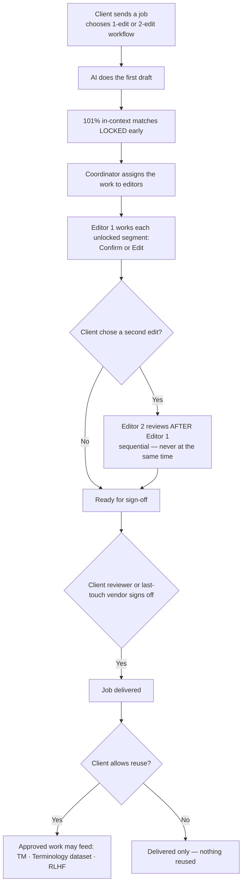
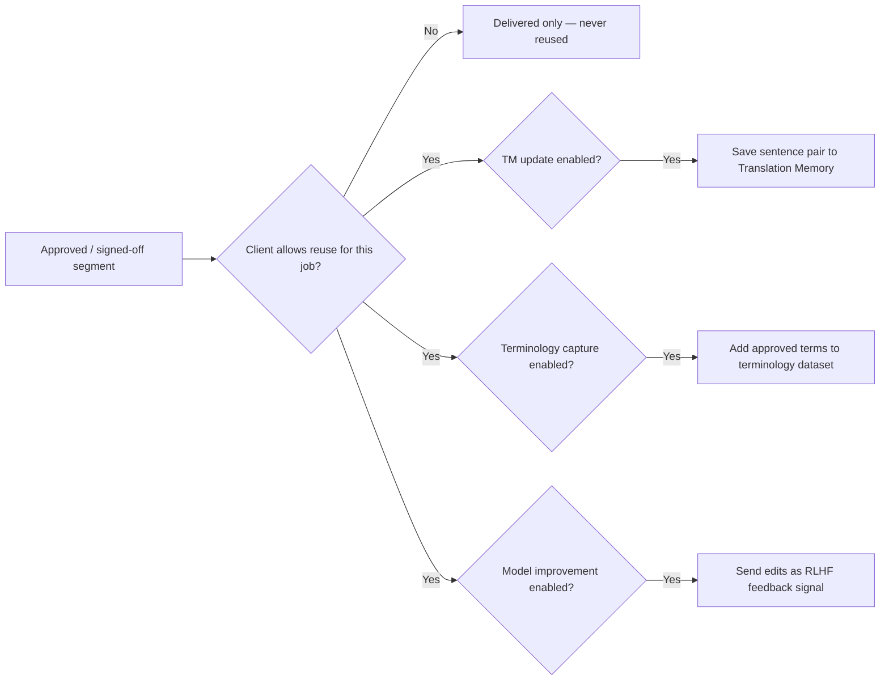

# arbitr Human-in-the-Loop (HITL) — Simple Requirements

*One page for Finance and Dev. Plain words. If a 12-year-old can't follow it, it's wrong.*

> **v2 — updated after team feedback.** The earlier draft invented a few steps that
> aren't in Straker's real workflow (a Straker "final validator," Reject/Escalate
> states, four-eyes on "important" jobs, one vague "teach the AI" step). This version
> matches reality. A short **"where the prototype still differs"** punch-list for Dev
> is at the end (Section 11).

---

## 1. The big idea (in one breath)

The AI does a **first draft**. Then **people fix the parts that matter**.
The **client** is the one who says "yes, this is good" at the end.
Every choice is **written down** so we can always see who did what.

That's it. Everything below is just the details.

---

## 2. The cast (who does what)

| Person | Side | What they do |
|---|---|---|
| **Vendor editor** | Straker network | Edits the segments on **their own assigned job only**. Can't see other vendors' work. |
| **Internal editor** | Straker | Edits segments on jobs in their team's scope (when Straker does the editing). |
| **Coordinator / PM** | Straker | Hands jobs to editors, moves them around, balances the load. |
| **Client reviewer** | Client | Reviews and **signs off** the job. The final "yes." |
| **Admin** | Straker / platform | Sets the rules, fixes mistakes, configures policies. |

**There is NO "final validator" role on the Straker side.** A job may or may not have a
client reviewer at all. By default, **sign-off is done by the client reviewer, or by the
vendor who last touched the job** — never by a Straker person reading the whole file.

**Rule:** every action checks "are you allowed to do this?" first. If not, it's blocked **and** the attempt is recorded.

---

## 3. The pieces (what we're moving around)

Think of it like a stack of pages going through an editing line.

- **Job** — the whole piece of work. It has **two names**:
  - **Job ID** — the internal reference (e.g. `JOB-2026-04812`). We use this everywhere internally; with thousands of jobs, names alone get messy.
  - **Job name** — the friendly label the client sees (e.g. "Q3 Earnings Report → Japanese").
- **Task** — a chunk of the job given to one editor.
- **Segment** — one sentence/row. The smallest unit.
- **Decision** — what happened to a segment (confirmed, edited, or locked).
- **Sign-off** — the client's (or last-touch vendor's) "the whole job is good."
- **Audit log** — the diary. Every action, forever, by **Job ID**.

---

## 4. What can happen to a segment (kept simple)

Most segments only ever get **two** things done to them — plus some are **locked before anyone starts**.

| State | When | Plain meaning |
|---|---|---|
| **Locked (set early)** | **Before review** | The safest matches — **101% (in-context exact) TM matches** — are locked up front so editors **can't change them**. They're already correct. |
| **Confirm** | During review | "This is good, leave it." (One action. There is no separate "verify" vs "accept.") |
| **Edit** | During review | "I improved it — here's the better version." |

That's the whole list. **No Reject, no Escalate, no "needs rework"** — those are not part of
the workflow today. If a segment is wrong, the editor simply **edits** it.

---

## 5. The human gates (where a person must act)

1. **Editing** — a person edits the segments that need it (the locked 101% ones are left alone).
2. **Second review (only if the client asked for it)** — see below.
3. **Sign-off** — the **client** (or the last-touch vendor) approves the job.

### About "second review" (the old "four-eyes")
- **Straker does not decide which jobs get a second editor.** The **client chooses** the
  workflow — with or without a second edit — **before they send the job** to Straker.
- If a second edit is included, it runs **one after the other (sequential)**: the second
  editor only starts once the first editor has finished. It must **never run in parallel**,
  or two editors could overwrite each other's segments.

### About sign-off
- **Client-side only.** No Straker human reads the files to sign off.
- By default the signer is the **client reviewer**; if the client delegates it, the
  **vendor who last touched the job** can sign off.

---

## 6. The golden rules (must always be true)

1. **Permission first.** Every change checks the person's role. Blocked attempts are logged, not silently dropped.
2. **Everything is written down.** Every action and denial goes in the audit log with who, what, when — keyed by **Job ID**.
3. **Lock the safe stuff early.** 101% in-context matches are locked **before** editing so no one changes what's already right.
4. **The client signs off.** Sign-off is a client-side action (or the last-touch vendor). No Straker final validator.
5. **Editors stay in their lane.** A vendor editor only touches their own assigned segments — never another vendor's.
6. **A second edit is the client's choice, and it's sequential.** Only if the client selected it, and only one editor at a time.
7. **Improving the AI is three separate, governed things** (see Section 7) — not one vague "training."

---

## 7. How approved work improves the AI (three SEPARATE things)

This is the big correction. "Train the AI" is **not one thing** — it's **three different
pipelines**, each tracked and governed on its own:

| # | Pipeline | What it means | Plain example |
|---|---|---|---|
| 1 | **Translation Memory (TM) update** | Approved final sentence pairs are saved so the **same/similar sentence is reused** next time. | "We confirmed this sentence → store it so the next identical sentence is auto-filled." |
| 2 | **Terminology dataset update** | Approved **term choices** are captured to update the **terminology agent's** dataset. | "のれん → Goodwill (never 'goodwill premium') → add to the term list." |
| 3 | **Model improvement (RLHF)** | Human edits/preferences are used as **feedback to improve the model** over time. | "Editors kept rewriting the AI's phrasing this way → feed that back to make the model better." |

Each pipeline is **opt-in per client/job** and only ever uses **approved** work.

> **⚠️ Open questions for Product/ML (not decided yet):**
> - **Who is "authorized" to approve feeding each pipeline?** (Client? Straker ops? Per-pipeline?)
> - **How does RLHF actually run** — batch cadence, which signals, who reviews the result?
> - **Does TM update need approval at all,** or is an approved/signed-off segment automatically TM-eligible?
> These were unclear in the earlier draft. We should decide them before building pipeline 3.

---

## 8. Workflow diagrams

### A job's journey



### The three improvement pipelines (each gated on its own)



---

## 9. Scenarios (Gherkin — copy/paste-able for dev tests)

### Editing segments

```gherkin
Feature: Editing segments

  Scenario: High-confidence matches are locked before editing starts
    Given a job has segments that are 101% in-context TM matches
    When editing begins
    Then those segments are already locked
    And an editor cannot change them

  Scenario: An editor confirms a segment
    Given I am an editor with permission on this job
    When I mark an unlocked segment "Confirm"
    Then the segment is recorded as confirmed
    And the action is written to the audit log against the Job ID

  Scenario: An editor edits a segment
    Given I am an editor with permission
    When I change an unlocked segment and save
    Then the new text becomes the segment's value
    And the original value is kept in the record

  Scenario: A vendor editor cannot touch another vendor's work
    Given I am a vendor editor
    When I try to act on a segment that is not on my assignment
    Then the action is blocked
    And an "access denied" entry is written to the audit log
```

### Two-editor (second review) workflow

```gherkin
Feature: Optional second edit, chosen by the client

  Scenario: The client decides whether there is a second editor
    Given a client selects a "two-edit" workflow before sending the job
    Then the job is set up for a first edit and a second edit
    And Straker does not add or remove the second edit on its own

  Scenario: The second edit happens after the first, never in parallel
    Given a job has a second edit
    When Editor 1 has not finished
    Then Editor 2 cannot start
    And the two editors can never edit the same segments at the same time
```

### Sign-off (client-side)

```gherkin
Feature: Sign-off is a client action

  Scenario: The client reviewer signs off
    Given a job is finished editing
    When the client reviewer signs off
    Then the job is marked signed off and delivered
    And the sign-off is recorded against the Job ID

  Scenario: Last-touch vendor signs off when delegated
    Given the client has delegated sign-off
    When the vendor who last touched the job signs off
    Then the job is marked signed off

  Scenario: No Straker person signs off the files
    Given a job needs sign-off
    Then sign-off is only available to the client reviewer or the last-touch vendor
    And never to a Straker internal reviewer
```

### Improving the AI (three separate pipelines)

```gherkin
Feature: Approved work can improve the AI in three separate ways

  Scenario: Translation Memory update
    Given a job is signed off
    And the client allows reuse
    And TM update is enabled for this job
    Then approved sentence pairs are saved to the Translation Memory

  Scenario: Terminology dataset update
    Given a job is signed off
    And terminology capture is enabled
    Then approved term choices are added to the terminology agent dataset

  Scenario: Model improvement (RLHF)
    Given a job is signed off
    And model improvement is enabled
    Then the human edits are sent as RLHF feedback

  Scenario: The client can forbid all reuse
    Given a job's policy says "do not reuse"
    Then none of the three pipelines run for that job
```

### Picking a vendor

```gherkin
Feature: Vendor selection

  Scenario: Recommend the best-matched vendor
    Given a job needs a vendor
    When the selection engine runs
    Then vendors that fail the hard rules are disqualified with reasons
    And the rest are ranked by score
    And the top match is recommended

  Scenario: Auto-assign only when it is safe
    Given a recommended vendor
    When the policy allows auto-assign
    And the score is above the threshold
    And the pool does not require manual approval
    Then the vendor can be assigned automatically
    Otherwise a human must approve the assignment
```

---

## 10. Where each rule lives (for Dev)

| Rule / workflow | Code |
|---|---|
| Permission gate + denial logging | `services/hitl/rbac.js` |
| Segment actions (confirm / edit / lock) | `services/hitl/review.js` |
| Sign-off + record | `services/hitl/signOff.js` |
| Reuse pipelines (TM / terminology / RLHF) | `services/hitl/retrainingGate.js` (three separate pipelines) |
| Assigning / second-edit / reassign | `services/hitl/taskAssignment.js` |
| Vendor recommend + auto-assign gating | `services/hitl/selectionEngine.js` |
| The diary | `services/hitl/auditLog.js` |
| The screens | `components/HITLVendorWorkflow/` |

---

## 11. Alignment status (Dev punch-list — now done ✅)

The prototype was originally built before this feedback. The code has since been
aligned to this doc. All seven items are complete:

1. ✅ **Extra segment states removed** — `not-verified` / `rejected`, `escalated`, and
   `needs-rework` are gone. The write path (`review.js`) only accepts **confirm**, **edit**,
   and **lock**; the audit cockpit and quick-review surfaces no longer offer the others.
2. ✅ **Verify + Accept collapsed into one "Confirm"** (`decision: 'confirmed'`).
3. ✅ **Lock moved to the start** — 101% in-context (ICE) matches seed as `locked` /
   `lockReason: 'ice-match'` and are read-only before any editing.
4. ✅ **Straker "final validator" dropped from sign-off** — `signOff.js` authorises by role:
   **client reviewer or last-touch vendor** (admins always allowed); no `signoff_output`
   permission is required.
5. ✅ **Second edit is client-selected and sequential** — at most one second editor per job;
   `secondEditorCanStart()` blocks editor 2 until editor 1's pass is complete; `review.js`
   refuses an early second-editor write.
6. ✅ **Reuse gate split into three pipelines** — `evaluateForTM`, `evaluateForTerminology`,
   `evaluateForModel` (RLHF additionally requires a rationale tag), each separately enabled
   (`tmAllowed` / `terminologyAllowed` / `modelImprovementAllowed`) and approvable.
7. ✅ **First-class Job ID** — every project carries a `jobId` (e.g. `JOB-2026-04812`),
   stamped on sign-off and related audit entries.

---

## 12. What's real vs. demo

- **Real & tested today:** permissions + denial logging, segment confirm/edit, early ICE
  lock, vendor scoping, locked-segment refusal, client-side sign-off + locking, assignment
  & reassign-needs-reason, client-chosen sequential second edit (with the
  editor-2-after-editor-1 gate), vendor auto-assign gating, and the three reuse-eligibility
  pipelines (TM / terminology / RLHF).
- **Always demo, not live:** AI drafting / confidence / flags are sample data; the actual TM
  write, terminology-dataset write, and RLHF run are integration/ML work, not built here.
