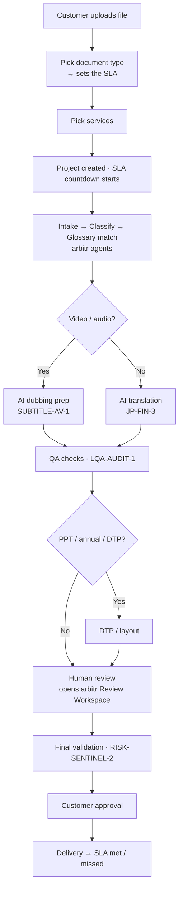
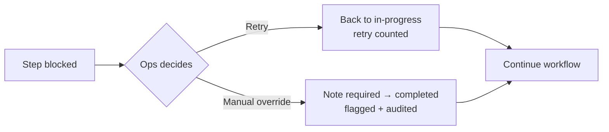

# SwiftBridge AI V2 (Japan) — Simple Requirements

*One page for Finance and Dev. Plain words. If a 12-year-old can't follow it, it's wrong.*

> **What SwiftBridge is.** SwiftBridge is the **customer-facing brand in Japan**
> (スイフトブリッジAI). The engine underneath is **arbitr (アビタAI)** — the same
> platform the rest of this app is built on. Customers see "SwiftBridge"; the
> automated steps are run by **arbitr marketplace agents**, and the human-review
> step opens the **same arbitr Review Workspace** used everywhere else.
> *"Customers don't feel the platform; sales can show it."*

---

## 1. The big idea (in one breath)

A customer **uploads a document**. The AI runs it through a **workflow**.
A **person reviews the parts that matter**, the **customer approves**, and we
**deliver inside a promised time (the SLA)**. Every step is **visible** and
**written down**.

That's it. Everything below is just the details.

---

## 2. The cast (who does what)

| Who | Side | What they do |
|---|---|---|
| **Customer** | Client (Japan) | Uploads the file, picks the document type + services, and **approves** at the end. |
| **arbitr agents** | Platform (アビタAI) | Do the automated steps — classify, match glossary, translate, dub, run QA. |
| **SwiftBridge review team** | SwiftBridge | The **human review** gate — checks the AI output before the customer sees it. |
| **Ops** | SwiftBridge / platform | Fixes stuck steps (retry / manual override). Every override is recorded. |

**The agents (and what each one powers):**

| Agent ID | Name | Powers |
|---|---|---|
| `RISK-SENTINEL-2` | Quality Risk Agent | Document classification + final validation |
| `TERM-GUARDIAN-1` | Terminology Guardian | Glossary / terminology matching |
| `JP-FIN-3` | J-GAAP Specialist | AI translation |
| `SUBTITLE-AV-1` | Subtitle & Media Localizer | AI dubbing |
| `LQA-AUDIT-1` | Localization QA Auditor | QA checks |

---

## 3. The pieces (what we're moving around)

- **Project** — one job (e.g. `SB-2026-041`). Has a document type, a language pair (JA → EN), services, and an SLA.
- **Document type** — what kind of file it is. **The type decides the SLA.**
- **SLA** — the **promised delivery time** (a countdown). It can be **met**, **missed**, or **breached** (overdue).
- **Workflow step** — one stage in the pipeline. Each step is one of three **kinds**: **AI agent**, **human review**, or **customer action**.
- **Glossary** — the customer's approved word list (JA → EN), version-tagged.
- **Dubbing job** — a video/audio job that goes through its own staged pipeline.
- **QA finding** — one issue caught by the QA agent (with a severity).
- **Audit log** — the diary. Project created, step retried, step overridden — all recorded (`surface: swiftbridge-v2`).

---

## 4. The delivery promises (SLA by document type)

The SLA is **not** a guess — it's fixed by the document type.

| Document type | 日本語 | SLA |
|---|---|---|
| Timely disclosure | 適時開示 | **24 hours** (24時間以内) |
| Quarterly report | 四半期報告書 | **24 hours** (24時間以内) |
| PowerPoint deck | 決算説明資料 | **72 hours** (72時間以内) |
| Annual securities report | 有価証券報告書 | **10 business days** (10営業日以内) |
| Video / audio (dubbing) | 動画・音声（吹替） | **5 business days** (5営業日以内) |

The countdown starts when the project is created. Delivered **on or before** the
deadline = **SLA met**. Delivered after, or already overdue = **missed / breached**.

---

## 5. The workflow (what happens to a project)

Every project runs the **same canonical chain**. Some steps only appear when needed.

1. **File intake** *(agent)*
2. **Document classification** *(agent — `RISK-SENTINEL-2`)*
3. **Terminology / glossary matching** *(agent — `TERM-GUARDIAN-1`)*
4. **AI translation** *(agent — `JP-FIN-3`)* **or** **AI dubbing preparation** *(agent — `SUBTITLE-AV-1`)* — dubbing replaces translation for video/audio jobs
5. **QA agent checks** *(agent — `LQA-AUDIT-1`)*
6. **DTP / layout** *(agent)* — **only** for PowerPoint, annual reports, or when DTP is selected
7. **Human review** *(human gate — SwiftBridge review team)* → **opens the arbitr Review Workspace**
8. **Final validation** *(agent — `RISK-SENTINEL-2`)*
9. **Customer approval** *(customer gate)*
10. **Delivery** *(agent)*

**A step can be in one of these states:** `pending` · `in_progress` · `completed` · `blocked` · `needs_review`.

**Two things ops can do to a step:**
- **Retry** — only a **blocked** step can be retried (it goes back to in-progress; the retry is counted).
- **Manual override** — ops can force a step complete, **but a note is required** and it's flagged in the audit log. **Completed steps can't be changed.**

---

## 6. The human gates (where a person must act)

Every workflow has, by construction, **at least one human review** and **exactly one customer approval** — these **cannot be configured away**.

1. **Human review** — the SwiftBridge review team checks the output. This step **deep-links into the real arbitr Review Workspace** (the same confirm/edit cockpit used across the platform).
2. **Customer approval** — the customer signs off before delivery.

---

## 7. Glossary & custom agents (customer-managed)

- The glossary is a list of terms: **JA → EN**, each with a **status**: `approved`, `pending`, or `forbidden`.
- The customer can **add** a term — it enters the **approval queue** (`pending`) and is **not used until approved**.
- A **custom agent** = a base arbitr marketplace agent (e.g. `JP-FIN-3`) **+** a bound glossary **+** style rules (e.g. "Formal IR register", "US investor English"). With validation on, **every output is checked against the approved terms before QA.**

**The live compliance check** gives each term one of four verdicts:

| Verdict | Meaning |
|---|---|
| **pass** | The approved English rendering is present (or a forbidden term is correctly absent). |
| **missing** | The JA term appears but its approved English rendering does not. |
| **violation** | A **forbidden** rendering was used. |
| **not-present** | The term isn't in this text at all (hidden from the results). |

> **Pending terms are excluded** from the compliance check until someone approves them.

---

## 8. AI Dubbing (its own staged pipeline)

Video/audio jobs walk a 7-stage pipeline with **two human gates**:

`Upload` *(agent)* → `Transcript` *(agent)* → **`Script review`** *(human)* → `Voice & tone` *(customer)* → `Preview` *(agent)* → **`Approval`** *(human)* → `Export` *(agent)*

Voices are picked by tone: **Aoi** (Formal IR), **Kenji** (Neutral), **Mika** (Warm).
The preview regenerates whenever the script or voice changes.

---

## 9. QA findings

Each QA finding has a **category** (terminology / formatting / missing / inconsistency),
a **severity** (`critical` / `major` / `minor`), a **location**, and a **resolution**
(`open` → `approved` or `rejected`), plus an optional reviewer comment.

---

## 10. The golden rules (must always be true)

1. **The document type sets the SLA.** No type, no promise.
2. **Every workflow has a human review and a customer approval.** They can't be removed.
3. **Only blocked steps can be retried.**
4. **A manual override always needs a note** and is written to the audit log. **Completed steps are immutable.**
5. **Pending glossary terms never affect output** until approved.
6. **Automated steps name the arbitr agent that ran them** — the platform is always visible to the team (and to sales).
7. **The human-review step uses the real arbitr Review Workspace** — SwiftBridge doesn't have a separate review tool.

---

## 11. Workflow diagrams

### A project's journey



### A stuck step



---

## 12. Scenarios (Gherkin — copy/paste-able for dev tests)

### Creating a project & the SLA

```gherkin
Feature: A document type sets the delivery promise

  Scenario: Picking a quarterly report promises 24 hours
    Given a customer uploads a file
    When they choose document type "Quarterly report"
    Then the project's SLA is set to 24 hours
    And the SLA countdown starts when the project is created

  Scenario: Every document type has a known SLA
    Then "timely disclosure" is 24 hours
    And "quarterly report" is 24 hours
    And "PowerPoint deck" is 72 hours
    And "annual securities report" is 10 business days
    And "video / audio dubbing" is 5 business days
```

### The workflow always keeps the human gates

```gherkin
Feature: Human review and customer approval cannot be removed

  Scenario: Any service combination still has the gates
    Given a customer selects any mix of services
    When the workflow is built
    Then it contains at least one human review step
    And it contains exactly one customer approval step

  Scenario: A dubbing job swaps in the dubbing path
    Given the document type is "video / audio dubbing"
    When the workflow is built
    Then it uses "AI dubbing preparation" instead of "AI translation"
    And it still has the script review and approval human gates
```

### Stuck steps: retry & override

```gherkin
Feature: Recovering a blocked step

  Scenario: Only blocked steps can be retried
    Given a step is "blocked"
    When ops clicks Retry
    Then the step goes back to "in progress"
    And its retry count goes up by one

  Scenario: An override needs a note
    Given a step is blocked
    When ops tries a manual override with no note
    Then the override is refused

  Scenario: A valid override is recorded
    Given a step is blocked
    When ops overrides it with a note
    Then the step is marked completed and flagged as an override
    And the note is written to the audit log

  Scenario: Completed steps are immutable
    Given a step is "completed"
    When anyone tries to override it
    Then it is refused
```

### Glossary & compliance

```gherkin
Feature: Customer-managed glossary

  Scenario: A new term waits for approval
    Given a customer adds a new term
    Then the term is "pending"
    And it is not used until someone approves it

  Scenario: The compliance check flags problems
    Given the glossary has an approved term and a forbidden term
    When an English output is checked
    Then a missing approved rendering is flagged "missing"
    And a forbidden rendering is flagged "violation"
    And a correct rendering is "pass"
    And pending terms are ignored
```

### AI dubbing

```gherkin
Feature: Dubbing keeps its human gates

  Scenario: Script review comes before voicing
    Given a dubbing job
    Then "script review" is a human gate before voice selection
    And "approval" is a human gate before export
```

### Delivery & SLA outcome

```gherkin
Feature: SLA outcome at delivery

  Scenario: Delivered on time
    Given a project delivered before its deadline
    Then the SLA shows "met"

  Scenario: Delivered late
    Given a project delivered after its deadline
    Then the SLA shows "missed"
```

---

## 13. Where each rule lives (for Dev)

| Rule / behaviour | Code |
|---|---|
| SLA targets + countdown (`slaFor`, `slaCountdown`) | `services/swiftbridge/swiftbridgeModel.js` |
| Workflow templates + human-gate guarantee (`buildWorkflow`) | `services/swiftbridge/swiftbridgeModel.js` |
| Step state machine (`retryStep`, `overrideStep`, `advanceStep`) | `services/swiftbridge/swiftbridgeModel.js` |
| Glossary compliance (`checkGlossaryCompliance`) | `services/swiftbridge/swiftbridgeModel.js` |
| Dubbing stages + voices · QA summary | `services/swiftbridge/swiftbridgeModel.js` |
| Demo seed (projects, glossary, dubbing, QA) | `services/swiftbridge/swiftbridgeModel.js` → `getSwiftBridgeDemo()` |
| Brand shell · tabs · dashboard · delivery | `components/HITLVendorWorkflow/SwiftBridge/index.jsx` |
| New-project wizard · workflow timeline | `components/HITLVendorWorkflow/SwiftBridge/ProjectWorkflow.jsx` |
| Dubbing · glossary/agents · QA screens | `components/HITLVendorWorkflow/SwiftBridge/Studio.jsx` |
| Nav entry ("SwiftBridge Japan" group) | `components/HITLVendorWorkflow/index.jsx` |
| Audit events (`swiftbridge.*`) | `services/hitl/auditLog.js` |
| Tests (~15) | `services/swiftbridge/__tests__/swiftbridgeModel.test.js` |

---

## 14. What's real vs. demo (so dev/sales aren't surprised)

- **Real & tested today:** SLA mapping + countdown, workflow building with guaranteed human gates, the step state machine (retry-only-when-blocked, override-needs-a-note, completed-is-immutable), glossary compliance verdicts, and the demo-seed consistency (delivered project = all steps done + SLA met; blocked PPT project = one blocked step with a retry; pending glossary terms excluded).
- **Real wiring to the rest of the platform:** automated steps name real arbitr marketplace agents; the **human-review step opens the actual arbitr Review Workspace**; project/step actions write to the **shared audit log**.
- **Always demo, not live:** file upload/storage, the dubbing audio preview (visual waveform only — no real TTS), document download buttons, and the final legal copy for 利用規約 / プライバシーポリシー (placeholder links). These are the **engineering prototype / sales mockup**, not production integrations.
